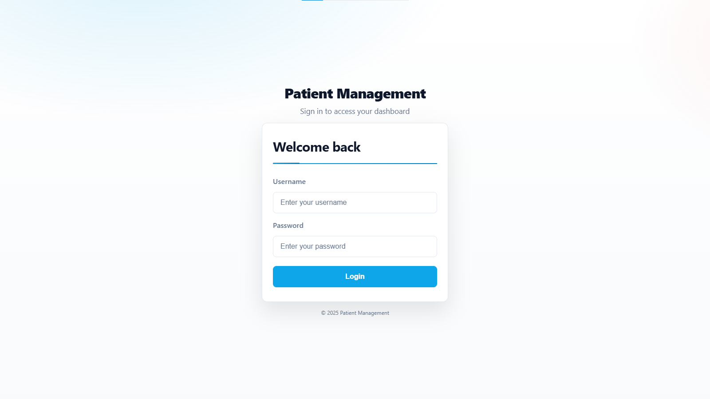
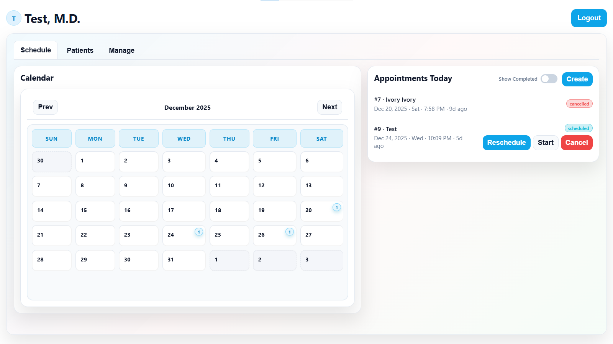
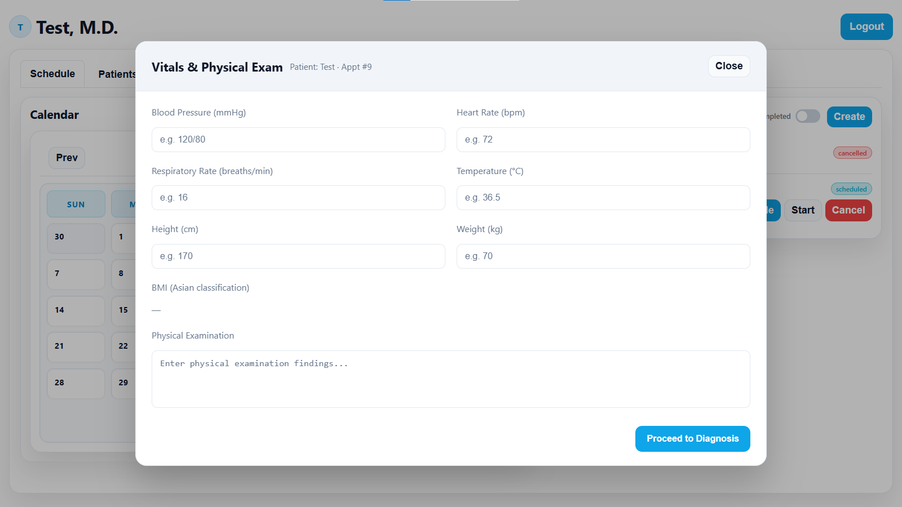
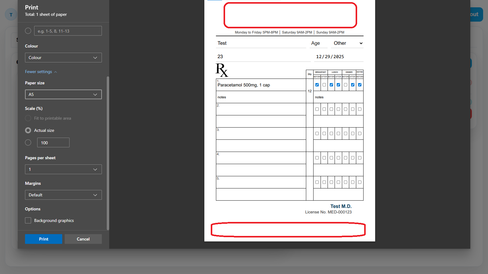
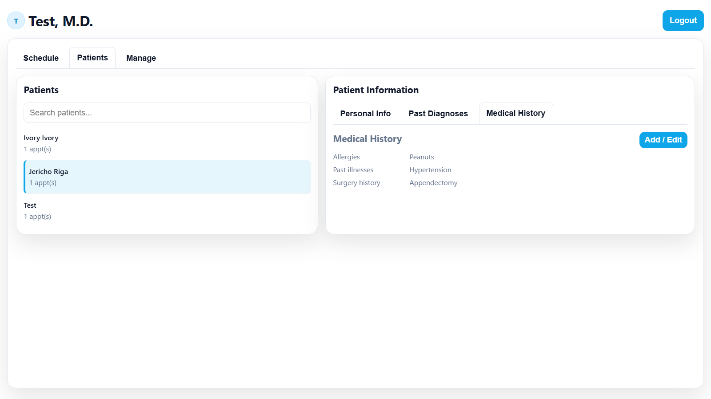

# 🏥 Multispecialty Clinic Management System

## 📌 Overview
Desktop application for managing clinic operations with multi-doctor support. Each doctor maintains separate patient records while sharing common clinic infrastructure. Helps medical professionals organize patient information, appointments, and medical documents.

---

## ✨ Features
- Multi-doctor appointment scheduling
- Individual doctor patient record management
- Medical document generation
- Daily clinic workflow management
- Doctor-specific data isolation

---

## 🖼️ Screenshots

  
   
  
  
   
  
  

---

## 🛠️ Tech Stack
| Component | Technology |
|-----------|------------|
| Backend | Node.js, Express |
| Frontend | Bootstrap |
| Database | SQLite |
| Platform | Windows Desktop |

---

> **Note:** This repository intentionally excludes setup instructions and sensitive configuration details due to confidentiality requirements.